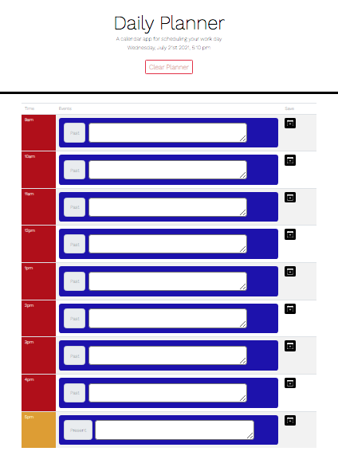
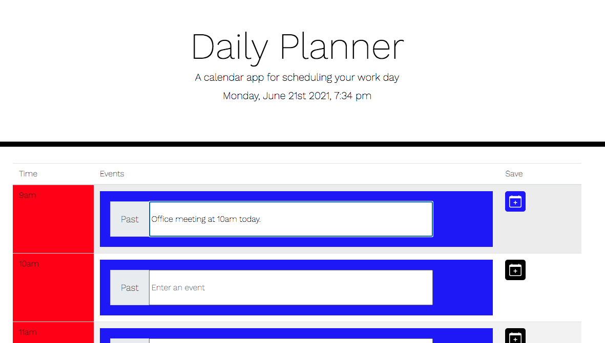
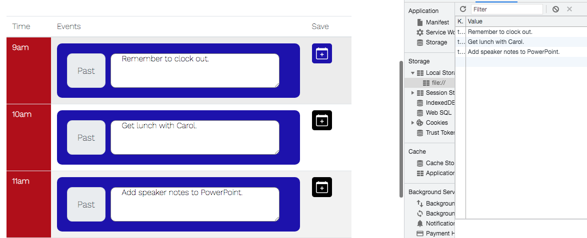
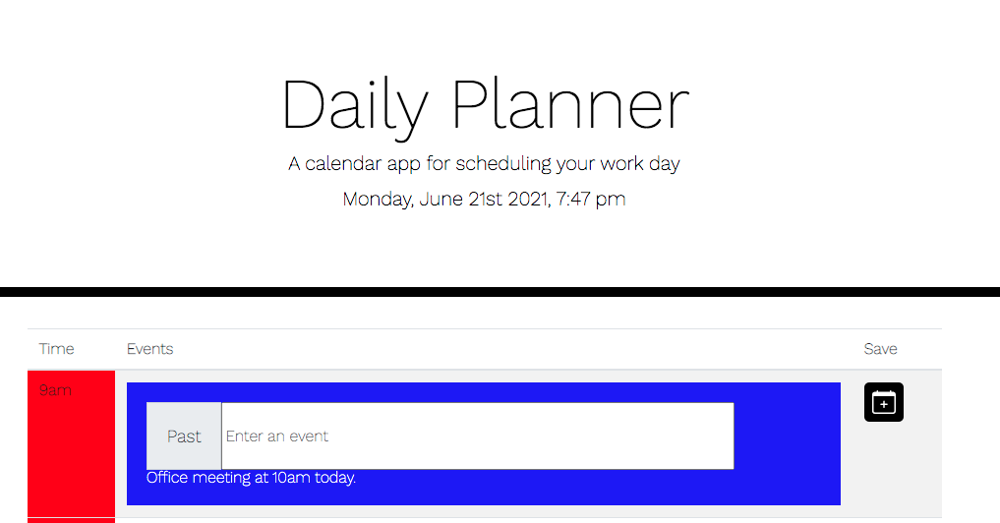
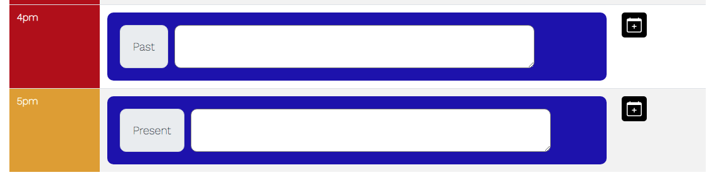

# daily-planner

Summary:
 
The objective of this application is to allow the user to properly create events within specified input fields and save those items onto their daily planner. Principles of Moment.js, jQuery, Bootstrap, HTML, CSS, and Javascript were used to achieve the end result. Please render using Chrome.

 

Breakdown:
 
Upon loading the page the user can see the current day and time. Using a color-coded template, the client is able to quickly see which working time slots are in the past, present, or future (red = past, yellow = current, and green = future). If an event arises, the user can type, save, and append their items into the appropriate working hour. Because events are saved in local storage if the user accidentally refreshes or exits the browser the events persist. To clear out the app's local storage and the text areas the user can click the "Clear Schedule" feature.

 

Application URL: 
 
Check out the deployed application here: https://tedheikkila.github.io/daily-planner/
 

 
Screenshots:
  
daily planner
 

 
current time/day & clear planner feature
 

events entered in and saved to app's localStorage
 

clear btn removes text from app and clears out localStorage
 

hour block changes color (red, yellow, green) and hour status changes text (past, present, future)

